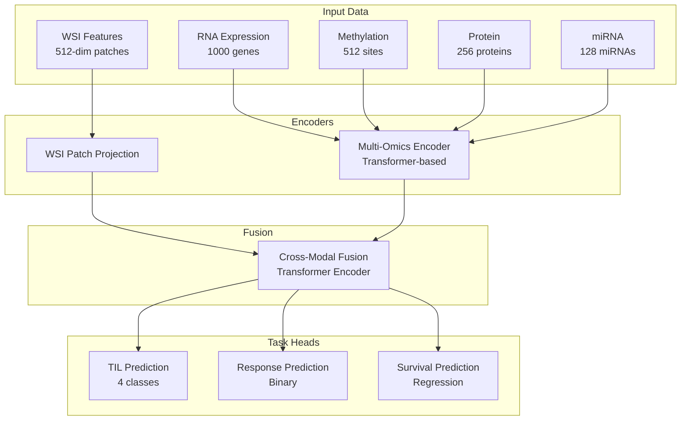

# Immunova: Multimodal AI Pipeline for Cancer Immunotherapy Prediction


A comprehensive multimodal AI pipeline for predicting cancer immunotherapy response, tumor-infiltrating lymphocytes (TIL), and survival outcomes using whole slide images (WSI) and multi-omics data.

## 🎯 Key Features

- **Multimodal Fusion**: Combines WSI features with multi-omics data (RNA-seq, methylation, protein, miRNA)
- **Multi-Task Learning**: Simultaneous prediction of TIL, immunotherapy response, and survival
- **Transformer-Based Architecture**: Advanced attention mechanisms for cross-modal fusion
- **Comprehensive Evaluation**: Built-in visualization and performance metrics
- **Modular Design**: Easy to extend and customize for different cancer types

## 📊 Model Architecture



## 🏗️ Project Structure

```
Immunova/
├── README.md                    # This file
├── DATA_SETUP.md               # Data preparation guide
├── task_requirements.txt       # Python dependencies
├── .gitignore                  # Git ignore rules
│
├── Core Pipeline/
│   ├── model.py                # Main multimodal model
│   ├── dataset.py              # PyTorch dataset class
│   ├── train.py                # Training script
│   ├── validate.py             # Validation script
│   ├── predict.py              # Prediction and visualization
│   └── model_caller.py         # Model inference utilities
│
├── Feature Extraction/
│   ├── WSI_feature.py          # WSI feature extraction
│   ├── Omics_feature.py        # Multi-omics preprocessing
│   ├── label_feature.py        # Label processing
│   └── inspect_pkl_keys.py     # Data inspection utility
│
├── Data Directories/
│   ├── wsi_feature/            # WSI feature files (.pkl)
│   ├── omics_feature/          # Multi-omics data (.pkl)
│   ├── label_feature/          # Label files (.pkl)
│   ├── Immunova2_Module1/      # WSI patch data by cancer type
│   └── Immunova2_module2/      # Clinical and omics data by cancer type
│
└── Outputs/
    ├── model.pth               # Trained model weights
    ├── predictions_*.csv       # Prediction results
    ├── val_ids.txt             # Validation patient IDs
    └── *.png                   # Visualization outputs
```

## 🚀 Quick Start

### Prerequisites

```bash
pip install -r task_requirements.txt
```

### 1. Data Preparation

See [DATA_SETUP.md](DATA_SETUP.md) for detailed instructions on preparing your data.

### 2. Feature Extraction

```bash
# Extract WSI features
python WSI_feature.py

# Process multi-omics data
python Omics_feature.py

# Generate label features
python label_feature.py
```

### 3. Training

```bash
# Train the model (configure task in train.py)
python train.py
```

### 4. Evaluation

```bash
# Validate model performance
python validate.py

# Generate predictions and visualizations
python predict.py
```

## 🔧 Configuration

### Model Configuration

Edit the configuration section in `train.py`:

```python
TASK = "survival"  # options: 'til', 'response', 'survival'
INPUT_DIMS = {"rna": 1000, "methyl": 512, "protein": 256, "mirna": 128}
BATCH_SIZE = 16
EPOCHS = 50
LEARNING_RATE = 1e-4
```

### Prediction Task

Change the task in `predict.py`:

```python
task = "response"  # options: 'til', 'response', 'survival'
```

## 📈 Model Details

### Architecture Components

1. **Multi-Omics Encoder**: Transformer-based encoder for each omics type
2. **WSI Patch Projection**: Linear projection of WSI features
3. **Cross-Modal Fusion**: Transformer encoder with attention mechanisms
4. **Task-Specific Heads**: Separate heads for each prediction task

### Input Data Format

- **WSI Features**: Tensor of shape `(n_patches, 512)` per patient
- **RNA Expression**: Tensor of shape `(1000,)` - top 1000 immune-related genes
- **Methylation**: Tensor of shape `(512,)` - immune-relevant CpG sites
- **Protein**: Tensor of shape `(256,)` - immune-related proteins
- **miRNA**: Tensor of shape `(128,)` - immune-related miRNAs

### Output Predictions

- **TIL**: 4-class classification (TIL infiltration levels)
- **Response**: Binary classification (therapy response)
- **Survival**: Regression (log-transformed survival time)

## 🎨 Visualization

The pipeline generates several visualizations:

- **ROC Curves**: For binary classification tasks
- **Precision-Recall Curves**: For imbalanced datasets
- **Survival Curves**: For survival analysis
- **Confusion Matrices**: For classification performance
- **Feature Importance**: For interpretability

## 🔍 Data Inspection

Use the inspection utility to examine your data:

```bash
python inspect_pkl_keys.py wsi_feature/wsi_features_ACC.pkl
python inspect_pkl_keys.py omics_feature/omics_dict.pkl
python inspect_pkl_keys.py label_feature/label_dict_ACC.pkl
```

## 🗂️ Supported Cancer Types

The pipeline supports the following TCGA cancer types:

- **ACC**: Adrenocortical Carcinoma
- **BLCA**: Bladder Urothelial Carcinoma
- **BRCA**: Breast Invasive Carcinoma
- **CESC**: Cervical Squamous Cell Carcinoma
- **CHOL**: Cholangiocarcinoma
- **COAD**: Colon Adenocarcinoma
- **ESCA**: Esophageal Carcinoma
- **HNSC**: Head and Neck Squamous Cell Carcinoma
- **LUAD**: Lung Adenocarcinoma
- **LUSC**: Lung Squamous Cell Carcinoma
- **MESO**: Mesothelioma
- **THYM**: Thymoma
- **UCEC**: Uterine Corpus Endometrial Carcinoma
- **UVM**: Uveal Melanoma
- And more...

## 🤝 Contributing

1. Fork the repository
2. Create a feature branch (`git checkout -b feature/amazing-feature`)
3. Commit your changes (`git commit -m 'Add amazing feature'`)
4. Push to the branch (`git push origin feature/amazing-feature`)
5. Open a Pull Request

## 📄 License

This project is licensed under the MIT License - see the [LICENSE](LICENSE) file for details.

## 📚 Citation

If you use this code in your research, please cite:

```bibtex
@article{immunova2024,
  title={Immunova: A Multimodal AI Pipeline for Cancer Immunotherapy Prediction},
  author={Your Name},
  journal={Journal Name},
  year={2024}
}
```

## 🆘 Support

For questions and support:

- 📧 Email: [kosh.sch@gmail.com]
- 📖 Documentation: [immunova.ai]
## 🙏 Acknowledgments

- The Cancer Genome Atlas (TCGA) for providing the data
- PyTorch team for the deep learning framework
- All contributors to this project

---

**Note**: This repository contains code and structure but excludes actual data files for privacy and size considerations. Please refer to [DATA_SETUP.md](DATA_SETUP.md) for information on preparing your own data.
